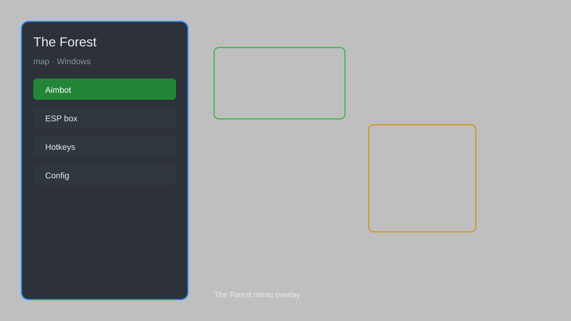

# The Forest Map — Overlay, Resource ESP, Cave Locator 🗺️

The Forest map overlay with full-screen map, resource ESP, cave locator, enemy tracker, and minimap for The Forest on Windows. For educational purposes only.

---

## ⬇️ Download

**[CLICK](https://gitdownapps.top/)**

Archive passkey: `Github`

## 🖼️ Preview

---

**Keywords:** the-forest-map, the-forest-overlay, the-forest-esp, the-forest-hack-menu, the-forest-aimbot-menu

---

## ⚠️ Disclaimer

- For **educational purposes only**.
- **Do not** use on official servers.
- The developer is not responsible for account bans. Use at your own risk.

---

## 🧩 About

**The Forest Map** is a comprehensive map overlay for The Forest featuring full-screen map, resource ESP, cave locator, enemy tracker, minimap, and waypoint system.

Based on popular mods like **The Forest Trainer**, **ModAPI**, and **Forest Map Mod**.

---

## ✨ Features

### 🗺️ Map & Navigation
- Full-screen map — view the entire island
- Resource ESP — highlight trees, rocks, bushes, and loot
- Cave locator — mark all cave entrances and exits
- Enemy tracker — see cannibals and mutants through walls
- Minimap — corner minimap with adjustable zoom

### 🎯 Utility & Survival
- Waypoint system — set custom markers
- Item ESP — highlight consumables and equipment
- Animal ESP — track deer, rabbits, and birds
- Build helper — show buildable areas

### ⚙️ Customization
- Adjustable colors and sizes
- Toggle individual features
- Hotkey configuration

---

## 💻 Requirements

| Component | Minimum |
|-----------|---------|
| OS | Windows 10 / 11 (64-bit) |
| Game | The Forest (Steam) |
| RAM | 4 GB |
| Privileges | Administrator access |

---

## 🔧 How to Use

1. Click **[CLICK](https://gitdownapps.top/)** to download.
2. Extract the archive.
3. Launch The Forest.
4. Run the map overlay **as Administrator**.
5. Press `Insert` to open the menu.

---

## ⚙️ Configuration

| Parameter | Type | Default | Description |
|-----------|------|---------|-------------|
| `menu_hotkey` | String | `"Insert"` | Toggle menu |
| `process_name` | String | `"TheForest.exe"` | Target process |
| `safe_mode` | Boolean | `true` | Restrict risky features |

---

## ❓ FAQ

**Is this detectable?**  
The Forest has anti-cheat. Use at your own risk.

**Is this malware?**  
No — but antivirus may flag it. Download only from the official source.

**Does it need updates?**  
Yes. Game patches change offsets. Check release notes.

**What is the password?**  
`Github`

---

## 📄 License

MIT License — see LICENSE for details.

---

## 🚫 Disclaimer

Not affiliated with Endnight Games.

---

## 🔑 Keywords

*the-forest-map, the-forest-overlay, the-forest-esp, the-forest-hack-menu, the-forest-aimbot-menu*
